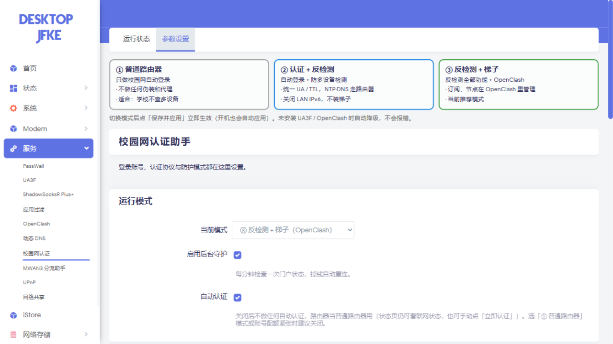
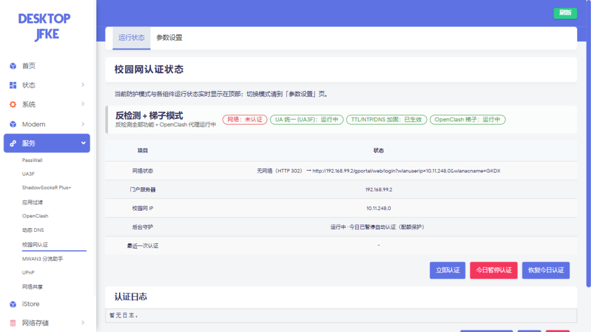

# OpenWrt Campus Auth — 校园网认证守护 + 多设备共存工具箱

[](https://github.com/Bianka5441/openwrt-campus-suite/actions/workflows/ci.yml)


> ⚠️ **免责声明**：本项目仅供网络协议学习与个人研究。使用前请了解所在网络服务条款，自行承担合规风险；请勿用于商业或破坏性用途。门户如明确要求停止共享（`reasoncode:55`），请先遵守。

---

## 一、这是什么？（新手从这里开始）

给 OpenWrt 路由器装上这一套，就得到：

- **校园网自动登录**：掉线自动重连，无需手动操作；
- **一键刷机**：一条命令、离线安装、自带全套验证——装完就是"插上网线即可用"；
- **三种防护模式**一键切换：普通路由器 / 认证+反检测 / 反检测+梯子；反检测模式**一次性拉起全套防护**（UA 统一 + 透明代理 + 防火墙加固 + 关 IPv6），并有 60 秒自愈守护；
- **省配额调度**：夜间断网静默、失败退避、绑定次数用完自动尝试"自己换绑给自己"；
- **中文 LuCI 界面**：状态页毫秒级渲染，实时显示各组件运行情况。

参数设置页（三张模式卡片，选一个点保存即可）：



运行状态页（顶部横幅显示当前模式与组件状态灯）：



如果你把校园网线插到 OpenWrt 路由器上，让宿舍所有设备（手机、电脑、平板）都通过它上网，通常会遇到两个麻烦：

1. **掉线要手动登录**：每次连接或被踢下线，都得打开浏览器输一遍校园网账号密码；
2. **多设备会被检测**：校园网有办法看出"这一个 IP 后面其实有好几台设备"，发现后会限速或暂停使用（本项目作者的学校是暂停 15 分钟）。

这个仓库提供一套**在路由器上运行**的组合方案，同时解决这两个问题：

| 组件 | 解决什么 | 一句话原理 |
|---|---|---|
| **campus-auth**（本仓库核心） | 掉线自动重连 | 后台每分钟检查一次门户状态，掉线自动帮你登录，还带 LuCI 网页管理界面 |
| **UA3F**（第三方开源工具） | 多设备被识别（User-Agent 特征） | 把所有设备网页请求里的"设备身份证"（User-Agent）统一改写成同一条 |
| **OpenClash** | 流量编排 | 只把需要改 UA 的流量送进 UA3F，其余直连，任何单点故障都不影响全网 |
| **防火墙加固** | 另外三种检测手段 | 统一 TTL、统一时钟、统一 DNS |

**它不能做什么**（说清楚，避免误解）：校网如果检测"同时访问了多少不同网站"（SNI/行为画像），本方案不覆盖——需要一台自己的 VPS 做全流量代理，属于进阶玩法。

设计原则、反检测链路图与自愈体系的完整说明见 **[docs/ARCHITECTURE.md](docs/ARCHITECTURE.md)**。

## 二、30 秒名词表

| 名词 | 大白话 |
|---|---|
| 门户 / Portal | 校园网的登录页面（本项目默认 `192.168.99.2`，你的学校可能不同） |
| 认证 / auth | 登录校园网这个动作，成功后这个 IP 才能上外网 |
| User-Agent (UA) | 浏览器访问网站时自报的"我是谁"字符串，Chrome/手机 Safari 各不相同 |
| TTL | 每个网络包的"剩余生命值"，每经过一台设备减 1，不同系统初始值不同（Windows 128、Linux 64） |
| NAT | 所有设备的流量从路由器同一个出口出去，外面的网站只看到一个 IP |
| opkg / apk | OpenWrt 的包管理器（老系统 opkg，25.12 以后 apk），相当于手机上的应用商店 |

## 三、准备清单

- [ ] 一台刷好 OpenWrt/ImmortalWrt 的路由器，能通过 LAN（网线或 WiFi）连上你的电脑
- [ ] 路由器已设置 root 密码（全新刷机的系统，先在 LuCI 首页"系统→管理权"里设置，否则无法 SSH；一键刷机走 SSH 密钥时可以免密码）
- [ ] 校园网账号、密码（可先不给，刷完后在 LuCI 里填也行）
- [ ] 一台能上网的电脑（Windows 用 Git Bash / Linux / macOS 均可）

**选填**（换学校时才需要）：学校门户地址、门户协议类型、AES 密钥——见[第 8 节](#八换一所学校)。

## 四、三条部署路径，选一条

| 路径 | 适合谁 | 路由器需要联网吗 |
|---|---|---|
| **A. 一键刷机（推荐）** | 任何能连上路由器（LAN）的电脑 | **完全不需要** |
| **B. 手动分步** | 想理解每一步原理、或 A 出问题排错时 | 分步需要 |
| **C. 传统脚本（遗留）** | 旧教程/文档引用 | A 需要，B 不需要 |

路径 A 是当前主力的部署方式：电脑上一个脚本跑完——上传离线安装包 → 安装 → 落地反检测模式 → **逐项自检，任何一步不过关都明确报错退出**。

## 五、路径 A：一键刷机

**准备一次，处处使用**：在电脑上准备好[离线 bundle](#离线-bundle-的准备)，之后每台路由器都是一条命令：

```sh
sh tools/flash.sh 192.168.1.1                 # 基础：反检测全套，暂不写账号
sh tools/flash.sh 192.168.1.1 学号 密码        # 同时写入校园网账号
```

**安装器做了什么**（`tools/install-campus-suite.sh`，全自动无需选择）：

1. 双架构自检（mt7621 / mt7981），安装 `campus-auth` + LuCI 插件；
2. conffile 恢复：升级不覆盖已有配置，配置缺失自动从 ipk 提取；
3. UA3F：已装则复用，未装从 bundle 装；**强制打开总开关**（ipk 默认是关的）、SOCKS5 `127.0.0.1:1080`、GLOBAL Chrome UA；
4. 预置 OpenClash UA3F 模板（80 端口走 UA3F、其余直连）并设为运行配置，`redir-host-tun` 透明模式；
5. 凭据策略：命令行给了就写；已有就保留；都没有就留空（认证空转，反检测栈照常运行）；
6. 落地 `anti-detect` 模式：UA3F + OpenClash 启动等待、加固规则（有网立即生效，无网由热插拔补）、关 LAN IPv6；
7. **验证不过关不下班**：文件完整性清单、模式值、UA3F 监听、OpenClash 核心、utun 透明接口——任一失败即 FAIL，绝不静默。

**装完你只需要**：把校园网线插到 WAN 口。认证、加固补齐（含 TTL 内核模块自动安装）、OpenClash/UA3F 全部由[自愈体系](docs/ARCHITECTURE.md#六自愈体系)自动完成。

**离线 bundle 的准备**（一次）：

```sh
python tools/build-ipk.py        # 本地打包两个插件
mkdir -p /tmp/campus-suite-offline
cp artifacts/*.ipk /tmp/campus-suite-offline/   # campus-auth.ipk + luci-app-campus-auth.ipk
# 再放入 ua3f_<你的架构>.ipk（见 UA3F Releases）与 tools/install-campus-suite.sh
```

多台路由器共用同一份 bundle。

**多台路由器注意**：同一台电脑轮流刷多台时，每台的 SSH host key 都不同——报 `REMOTE HOST IDENTIFICATION HAS CHANGED` 是正常现象，`ssh-keygen -R <ip>` 清掉旧记录即可；识别"现在连的是哪台"看已装插件版本、MAC 地址和 uptime，**不要凭 IP 猜**。

### 路径 C：传统脚本（遗留）

旧版两条自动化路径仍然可用，仅作兼容保留：`tools/bootstrap-stack.sh`（路由器在线自装）与 `tools/pc-stage-and-deploy.sh`（电脑侧离线推送）。新部署请用路径 A。

### 路径 B：手动分步（理解原理用）

<details>
<summary>展开 5 个手动步骤</summary>

**1. 安装认证插件**：从 [Releases](https://github.com/Bianka5441/openwrt-campus-suite/releases) 下载 `campus-auth` 与 `luci-app-campus-auth` 两个包（架构无关，`all` 包），传到路由器后：

```sh
opkg install campus-auth_*.ipk luci-app-campus-auth_*.ipk
uci set campus-auth.config.username='学号'
uci set campus-auth.config.password='密码'
uci commit campus-auth && chmod 600 /etc/config/campus-auth
/etc/init.d/campus-auth enable && /etc/init.d/campus-auth start
```

**2. 安装 UA3F**：到 [SunBK201/UA3F Releases](https://github.com/SunBK201/UA3F/releases) 下载**与路由器架构一致**的包（架构看 `/etc/openwrt_release` 里的 `DISTRIB_ARCH`），然后：

```sh
opkg install ua3f_*_你的架构.ipk
cp docs/ua3f-config.example /etc/config/ua3f    # 统一 UA 配置（重要，见下方警告）
/etc/init.d/ua3f enable && /etc/init.d/ua3f restart
netstat -ln | grep 1080                          # 必须看到 127.0.0.1:1080 才继续
```

> **警告**：网上视频教程的 UA3F 旧版配置（`rewrite_rules` JSON 格式）与 3.6.0 新版**不兼容**，会导致"看似运行实则不改写"的静默失败。务必用本仓库 `docs/ua3f-config.example` 的格式。另外 ipk 自带配置的总开关 `ua3f.enabled.enabled` 默认为 **0**，不置 1 就是"看似运行实则没起"。

**3. 安装并配置 OpenClash**：安装后：

```sh
cp docs/openclash-ua3f.yaml /etc/openclash/config/openclash-ua3f.yaml
uci set openclash.config.enable='1'
uci set openclash.config.config_path='/etc/openclash/config/openclash-ua3f.yaml'
uci set openclash.config.en_mode='redir-host-tun'
uci commit openclash && /etc/init.d/openclash restart
```

配置的核心思想：**只有 TCP 80**（明文 HTTP，检测方唯一能看到 UA 的地方）走 UA3F，其余全部直连——这样 UA3F 挂了只影响 http 网页，不会全网断。

**4. 防火墙加固**：

```sh
sh docs/campus-detect-hardening.sh apply     # 先确认脚本内 WAN_IF 与实际一致
```

**5. 启动顺序**：UA3F 必须先于 OpenClash 就绪（模式管理器已处理）。

</details>

## 六、部署后验证

### 基础检查（路由器控制台上执行）

| # | 检查 | 命令 | 预期 |
|---|---|---|---|
| 1 | 模式落地 | `uci get campus-auth.config.mode` | `anti-detect` |
| 2 | UA3F 监听 | `netstat -ltn \| grep 1080` | `127.0.0.1:1080` |
| 3 | UA3F 参数 | `ps w \| grep ua3f` | 含 `-m SOCKS5 -f Mozilla/...` |
| 4 | OpenClash 核心 | `pgrep -f "/etc/openclash/"` | 有 PID |
| 5 | 透明接口 | `ip link \| grep utun` | 存在 |
| 6 | 加固规则 | `iptables -t nat -S \| grep -c dport=53` | ≥2（**无网也生效**） |
| 7 | 探针五项 | `/usr/bin/campus-auth --probe; cat /tmp/campus-auth.probe` | `ua3f/oclash/loop/hard` 全 `y`；`http=000` 只说明还没插校园网线 |

### 模式②全功能自检（强烈建议每台刷完做一遍）

**测试 1：UA 改写实测**（离线可做，不依赖外网）。在路由器上放一个回显 CGI，对比"经 UA3F"与"直连"的 UA：

```sh
printf '#!/bin/sh\necho Content-Type: text/plain\necho\necho UA=$HTTP_USER_AGENT\n' > /www/cgi-bin/ua-test
chmod +x /www/cgi-bin/ua-test
curl -s -x socks5h://127.0.0.1:1080 -A "LEAK-TEST" http://127.0.0.1/cgi-bin/ua-test
# 期望：UA=Mozilla/5.0 ... Chrome/133.0.0.0 ...（被改写）
curl -s -A "LEAK-TEST" http://127.0.0.1/cgi-bin/ua-test
# 对照组：UA=LEAK-TEST（原样，证明差异来自 UA3F）
rm -f /www/cgi-bin/ua-test
```

**测试 2：自愈实测**。杀掉 OpenClash 核心，60 秒守护循环应自动拉起：

```sh
kill -9 $(pgrep -f "/etc/openclash/clash" | head -1)
sleep 35 && pgrep -f "/etc/openclash/clash" && netstat -tln | grep 7890   # 新 PID + 端口恢复
```

最后从**局域网电脑**上做端到端 UA 验证（需要路由器已联网，必须 http 不是 https）：

```sh
curl http://httpbin.org/user-agent
```

期望返回统一后的 UA（如 `Chrome/133.0.0.0 (Windows NT 10.0; Win64; x64)`）——不管你用手机还是电脑发这个请求，结果都一样，就说明成功了。

**网页界面**：浏览器打开 `http://路由器IP/cgi-bin/luci` → **服务 → 校园网认证**：运行状态页实时显示防护模式/组件状态灯/最近认证结果/日志，参数设置页选模式和改配置。

## 七、日常使用

### 三种防护模式（LuCI → Settings 第一个选项，或 UCI 的 `mode`）

| 模式 | 做什么 | 适合谁 |
|---|---|---|
| ① `normal` 普通路由器 | **纯路由器：不自动登录校园网**，停掉 UA3F/OpenClash、撤掉加固规则、恢复 IPv6 | 不需要认证功能时 |
| ② `anti-detect` 认证+反检测 | 自动登录 + **UA3F 与 OpenClash 一次性拉起**（80 端口改写 UA、其余直连）+ TTL/NTP/DNS 加固 + 关 LAN IPv6 + 60 秒自愈守护 | 查多设备、不需要梯子 |
| ③ `proxy` 反检测+梯子 | ② 的全部 + UA3F 重定向模板（之后在 OpenClash 界面里加订阅即可） | 要梯子时 |

说明：

- 切换在 **Save & Apply 和每次开机时自动生效**（幂等：切回 ① 会自动停掉 UA3F/OpenClash、撤掉加固规则、恢复 IPv6）。
- ②/③ 模式下 OpenClash 由模式管理器负责启动与守护；订阅、节点、分流规则仍在 OpenClash 自己的界面里管理。
- 未安装 UA3F 或 OpenClash 时安装器会显式报错，运行期缺失则自愈循环会尝试拉起并记录日志（`grep mode: /var/log/campus-auth.log`）。
- 状态页顶部实时显示各组件的开/关状态。

### 掉线与配额

**掉线了怎么办？** 什么都不用做。守护每 60 秒检查一次门户，连续两次确认离线后自动重连（一般 2 分钟内恢复）。LuCI 状态页的"最近认证"会留下记录。

**学校有夜间断网（如 0 点断 6 点恢复）？** 把 Settings 里的静默窗口设为 `00:00`–`06:00`（默认就是）。断网期间插件完全静默，恢复后做当天第一笔登录——每笔登录都可能消耗账号的设备绑定配额，登录越少越省。注意断网时间表不是铁律（周末晚上可能不断网），不要按固定时刻表写死依赖。

**登录被拒、日志里 `reasoncode:7`（绑定次数用完）？** 插件会**先尝试"自己换绑给自己"**（reBindMac 填本机 MAC——换绑是移动既有绑定，实测可不消耗次数；v1.0.13-r13 起），成功则全自动恢复；若门户拒绝，则自动拉长重试间隔（默认 15 分钟一次，`login_holdoff` 可调），此时需要走人工渠道（见 FAQ）。

**日志里 `reasoncode:43`（"是否重新绑定至当前设备"）？** 这是门户在主动提供换绑：它附带的 bindmac 若就是路由器自己的 MAC，**v1.0.10 起插件自动确认换绑并重新登录**，无需人工（只动自己的绑定，不影响任何其他设备）；若 bindmac 是别的设备的 MAC，插件会拒绝并在日志里提示。

**遇到 `reasoncode:55`（检测到共享，暂停 15 分钟）？** 冷却期内插件**自动停手**，15 分钟后标记自动过期、恢复正常守护，无需手动干预。

**临时不想让它登录（配额紧张/搬网口途中）？** 状态页一键 **"今日暂停认证"**（当天有效，午夜自动解除），或 Settings 里把模式切成 **① 普通路由器**（彻底不认证，直到你切回来）。

**换密码 / 换账号？** LuCI → Settings 页改，或 `uci set campus-auth.config.password='新密码'` + `uci commit`。

**触发检测反复出现？** 按 [docs/TEST-PLAN.md](docs/TEST-PLAN.md) 做分阶段对照实验，定位是哪个特征在暴露（UA 已统一的情况下，下一个通常是 TTL 或 QUIC）。

**踩坑了？** 先看 [docs/LESSONS.md](docs/LESSONS.md) ——31 条实机部署踩坑实录，很可能你遇到的就是其中一条。

## 八、换一所学校

认证协议是插件式的：UCI 的 `protocol` 选项决定加载哪个适配器。

| 协议 | 状态 | 需要配置 |
|---|---|---|
| `gportal`（默认） | 生产可用（作者学校长期运行） | `auth_host`、`nas_name`、`aes_key`（密钥在门户登录页的 JS 里找） |
| `ruijie` 锐捷 eportal | 预览，未经实站验证 | 同上，接入前先抓浏览器登录包核对 |

新增协议只需写一个几十行的脚本（实现 `proto_check`/`proto_login` 两个函数），详见 `campus-auth/files/campus-auth.sh` 头部注释。

## 九、常见问题 FAQ

**Q：https 网站的 UA 会被改吗？**
不会，也不需要。TLS 加密让检测方看不到 https 的 UA；明文 http 才是 UA 暴露的地方，UA3F 只处理它。

**Q：会拖慢网速吗？**
几乎不会。只有 80 端口流量进 UA3F 改写一个请求头，其余流量直连；实测路由器负载接近 0。

**Q：运行状态页打开很慢/老自己白屏刷新？**
v1.0.13 已修复。旧版每 10 秒整页重载（慢链路上要卡几秒白屏）；现在页面瞬时渲染（只读本地缓存），联网检查等探测全部改为后台执行、10 秒轮询只刷新状态区块，主题框架不再重载。离线未认证时首次打开会短暂显示"检测中…"，几秒后自动出结果。

**Q：刷机时路由器必须有网吗？**
不需要。一键刷机（路径 A）全程离线：安装包由电脑推送，最后插上校园网线时插件自己完成首次认证和加固补齐。

**Q：手机连上后要装什么吗？**
什么都不用。所有处理都在路由器侧，设备无感知。

**Q：把路由器搬到别的宿舍/换网口，会影响登录吗？**
会，而且是本插件帮不了的那种。很多校园门户的"设备绑定"实际按**账号×网口位置**计数：路由器在原位置掉线重连是复用绑定、不消耗配额；换一个网口再登录 = 新绑定 = 消耗配额，配额烧光就报 `reasoncode:7`。**结论：路由器固定一个网口别搬，一台路由器一个账号**。

**Q：绑定次数用完了怎么恢复？**
三条路按顺序试：① 插件**自动"自己换绑给自己"**（v1.0.13-r13 起，日志见 `rebind` 字样）——移动既有绑定，实测可不消耗次数；② **学校 app → 增加绑定**（多数校园 app 的设备管理里都有，直接扩充名额，立刻生效）；③ 若日志报 `reasoncode:43` 且 bindmac 是本机 MAC，插件会自动换绑。都走不通再去 app"自助解绑设备"。另外注意：路由器断电重启后时钟可能慢几个小时，静默窗口等时间调度会跟着偏——LuCI 状态页核对时间，或 `date -s @<PC的epoch秒>` 手动校正。

**Q：路由器灯亮、网线通，但就是连不上（无 IP/无 ARP）？**
多半是配置分区（overlay）损坏导致系统没起来——频繁拔电的机器高发。走 **failsafe 救援**：断电 → 按住 RESET → 通电 → LED 快闪（每秒 4~5 次）后松开；路由器固定在 `192.168.1.1`（无 DHCP，电脑配静态 IP `192.168.1.x` 连接）。注意新式 DSA 平台（mt7981 等）failsafe **只监听 LAN1 口**。详见 [docs/LESSONS.md](docs/LESSONS.md) 第 31 条。

**Q：和 UA2F 什么关系？**
UA2F 是更早的内核态方案（需要编译进系统），UA3F 是用户态服务（opkg 即装），本方案选 UA3F 因为部署简单且支持 SOCKS5 模式与 OpenClash 配合。

## 十、故障排查速查

| 现象 | 一句话处理 |
|---|---|
| 全网断，OpenClash 大量连接 127.0.0.1:1080 失败 | UA3F 没跑：`/etc/init.d/ua3f start`，确认已 enable 且 `ua3f.enabled.enabled=1` |
| 只有 http 打不开，https 正常 | 规则正确但 UA3F 挂了（预期降级），重启 UA3F；60 秒自愈也会拉起 |
| UA 没被改写 | `ps w \| grep ua3f` 看参数是否 `-m SOCKS5 ... -f Mozilla/...`；`docs/LESSONS.md` 第 6 条 |
| OpenClash running 但流量没进代理 | 启动被打断规则没装全，守护循环会自动补；也可干净 restart 一次 |
| 加固规则时有时无 | 出口设备名变了；守护循环会按 UCI 重新应用，`grep hardening /var/log/campus-auth.log` 看记录 |
| 认证失败：reasoncode 27"密码错误" | 先逐字符核对凭据大小写，再查套餐是否到期（门户把多种失败都报成这条） |
| 认证失败：reasoncode 7 | 等插件自动自换绑；不行就 app"增加绑定"（见 FAQ） |
| 认证失败：reasoncode 55 | 真实检测信号，按第 7 节冷却 15 分钟 |
| TTL 规则一直没出现 | 正常——内核模块等首次联网由守护循环自动安装 |
| 日志是空的 | 正常——日志只记认证事件，一直在线就是空的 |
| 路由器彻底连不上（灯亮但无 IP） | failsafe 救援，见 FAQ |

更完整的踩坑案例：[docs/LESSONS.md](docs/LESSONS.md)。

## 十一、从源码构建

仓库本身是一个 OpenWrt feed，CI 会在 main 与 `v*` tag 上自动构建 ipk（24.10 SDK）与 apk（25.12 SDK）双格式，打 tag 自动发 Release：

```sh
./scripts/feeds update -a && ./scripts/feeds install -a
echo "src-link campusauth /path/to/openwrt-campus-auth" >> feeds.conf.default
./scripts/feeds install -f campus-auth luci-app-campus-auth
make defconfig && echo 'CONFIG_PACKAGE_luci-app-campus-auth=m' >> .config && make defconfig
make package/campus-auth/compile package/luci-app-campus-auth/compile V=s
```

无 SDK 本地快速打包（一键刷机用的就是这个）：`python tools/build-ipk.py`。**打包清单必须与 Makefile 对表**——漏文件会静默缺组件（LESSONS #28）。

## 十二、许可证与致谢

[Apache-2.0](LICENSE)。UA3F 为 [SunBK201](https://github.com/SunBK201/UA3F) 的独立开源项目，OpenClash 为 [vernesong](https://github.com/vernesong/OpenClash) 的独立开源项目，本方案仅做配置集成与文档。
